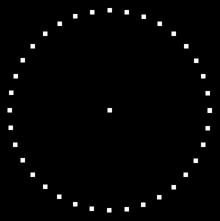
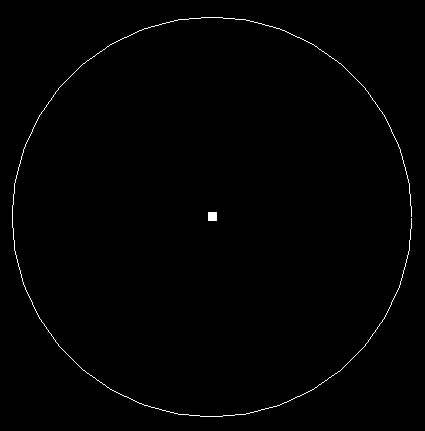
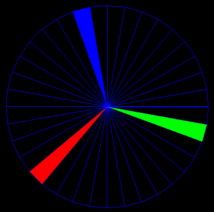
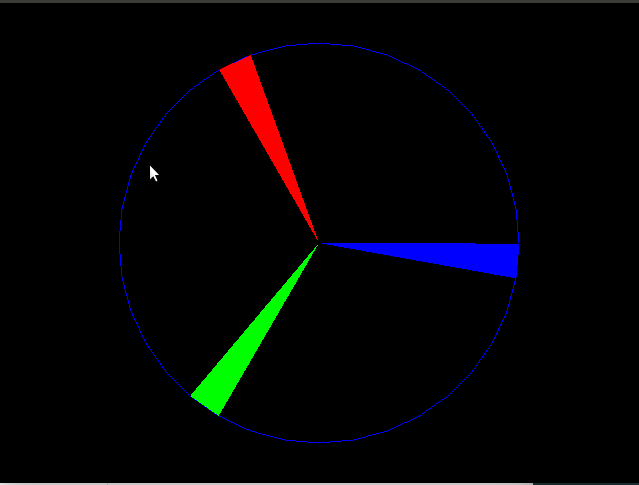

Using GLUT and OpenGL

-------------
## exercise_1

```
1. Draw a circle by exporting the set of points on its boundary. 
The distance between points is 10 degrees.
```



-------------
## exercise_2

```
2. Draw a circle by connecting the vertices in 
sentence 1.
```



-------------
## exercise_3

```
3. Divide the circle in sentence 2. 
Make into triangles by drawing the line between the center and the vertices on its boundary.
```



-------------
## exercise_4

```
4. Select 3 triangles from the triangle set in sentence 3, so that they are balanced on the circle. 
Color these 3 triangles. Do not draw other triangles,
let 3 triangles form a 3-bladed fan. 
Turn the fan around the center, then turn 100milisec.
```

